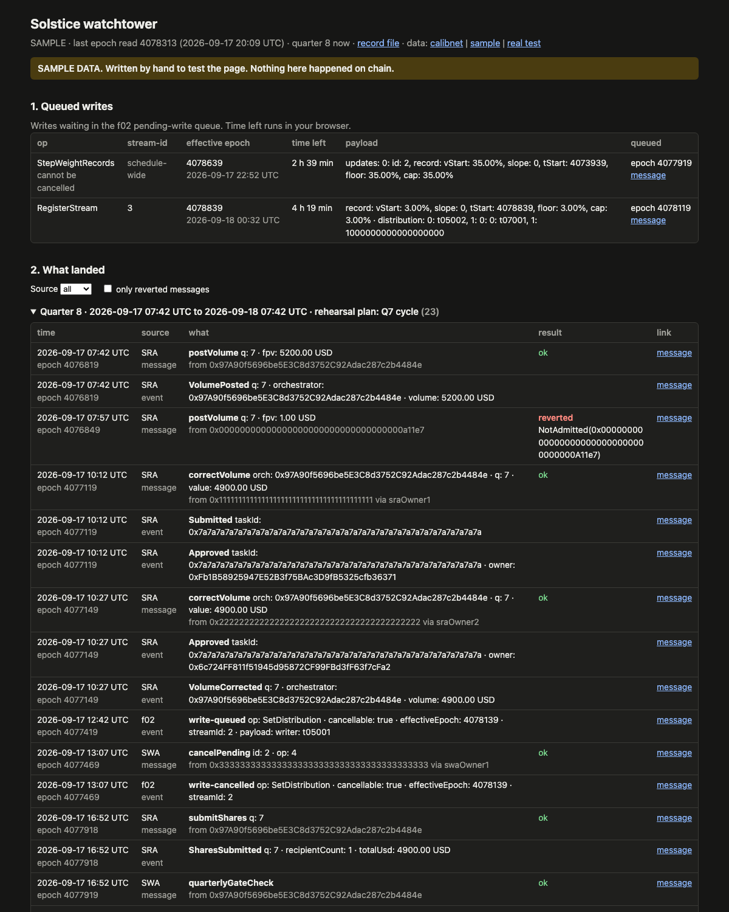

# Solstice watchtower (PoC)

Reads what landed on chain in f02, the SWA and the SRA (FIP-0118) and shows it on one page.
Scope: https://github.com/filecoin-project/solstice/issues/69. Design: [DESIGN.md](DESIGN.md).

*The page with SAMPLE data, written by hand to test it. Nothing in this screenshot happened on chain. The SRA and
the SWA reach calibnet on 2026-09-21; until then the real record holds only the f02 state and two balances.*

Needs Node.js 22 or newer.

| Command | What it does |
|---|---|
| `npm install` | Installs the two libraries (`viem`, `@ipld/dag-cbor`). Once. |
| `npm run read` | One run of the reader against calibnet. Only reads from the public RPC endpoint. Appends to `site/data/calibnet/records.jsonl`. |
| `npm run sample` | Writes a SAMPLE record to `site/data/sample/`, to look at the page before real data exists. |
| `npm run page` | Serves the page at http://localhost:8000 (sample view: http://localhost:8000/?data=sample). Stop with Ctrl+C. |
| `npm test` | Runs the decoder tests on hand-written sample inputs. |

When the contracts are deployed, put their addresses, `activationEpoch` and the wallets to watch into
`config/calibnet.json` (the values are in solstice `deployments.json`).
